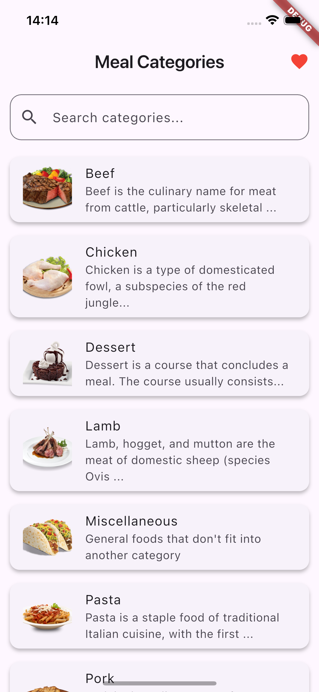
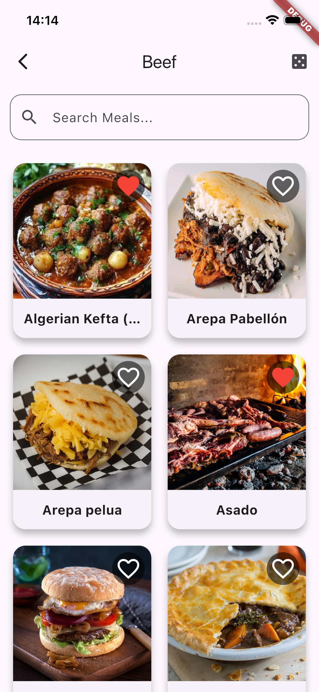
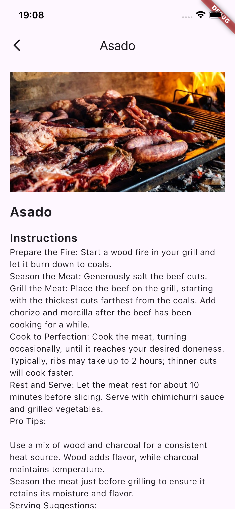
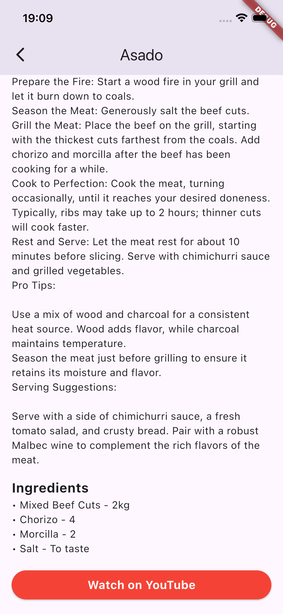
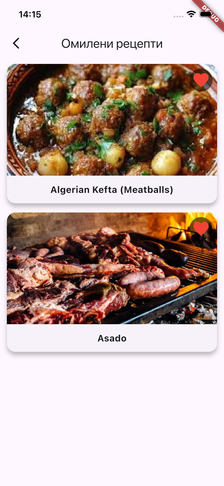
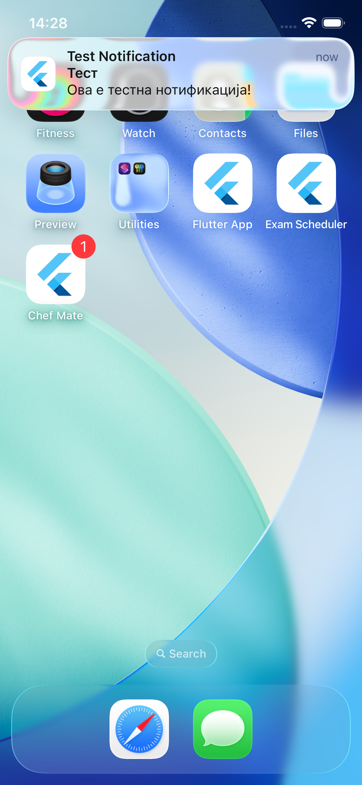

# 🍔 Chef Mate

**Chef Mate** is a Flutter mobile application that helps you explore meal recipes by category,
search for meals, and view detailed instructions with ingredients. You can also watch recipe videos
on YouTube.

## ✨ Features

* **Category Browsing:** Explore a wide range of meal categories.
* **Meal Search:** Quickly find specific meals using a name search.
* **Detailed Recipes:** View comprehensive instructions, ingredient lists, and high-quality images.
* **Video Integration:** Watch associated YouTube cooking videos directly from the meal details screen.
* **Random Meal:** Get inspired with a randomly suggested meal of the day.
* **Favorites Management:** Users can easily save and manage their preferred recipes via an interactive favorite icon and a dedicated **Favorite Screen**.
* **Daily Notifications:** Schedule automatic notifications to remind users about a daily meal idea.

## 🛠️ Tech Stack

* **Framework:** Flutter (Dart)
* **State Management:** Provider
* **Backend & Services:** **Firebase**
    * Used for push notifications (via FCM) or other backend services (e.g., storage for persistent data or remote configuration).
* **External APIs:** MealDB API (TheMealDB)

## 🖼️ Screens

- **Categories Screen**  
  

- **Meals Screen**  
  

- **Meals Details Screen**  
  
  

- **Favorite Screen**  
  

- **Notification**  
  