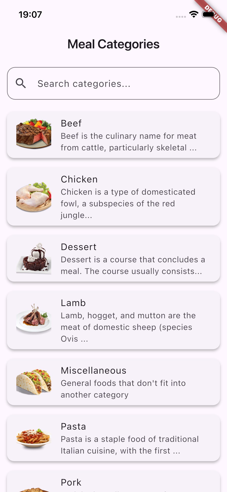
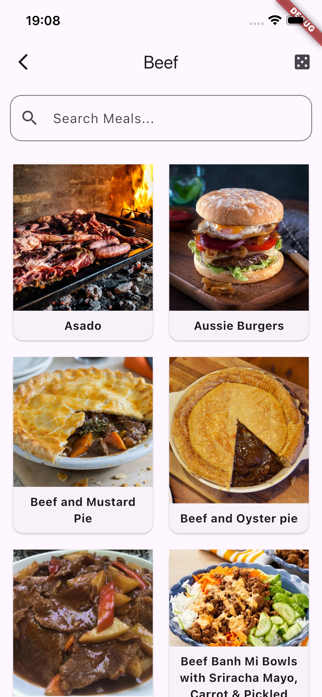

# 🍔 Chef Mate 

**Chef Mate** is a Flutter mobile application that helps you explore meal recipes by category, search for meals, and view detailed instructions with ingredients. You can also watch recipe videos on YouTube.  

## ✨ Features  
- Browse meal categories
- Search meals by name
- View detailed recipe: ingredients, instructions, and image
- Watch YouTube cooking videos
- Get a random meal of the day

## 🛠️ Tech Stack  
- **Framework:** Flutter (Dart)

## 🖼️ Screens
- **Categories Screen**  

- **Meals Screen**  

- **Meals Details Screen**  

